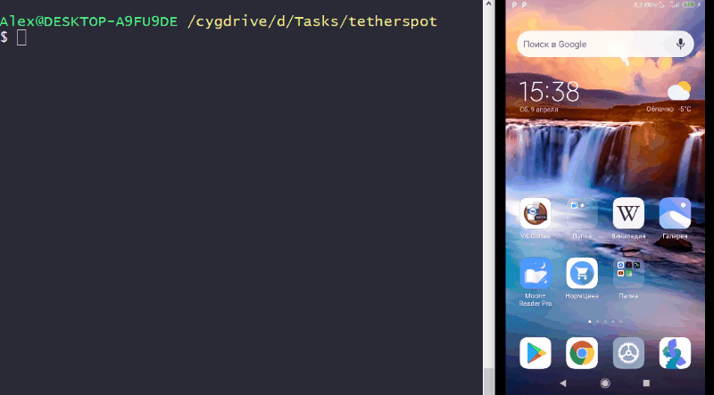

# Tetherspot

Script to simlify reverse USB tethering with WiFi hotspot on **non-rooted** Android

Schematic:


Demo:



## Why

To share unlimited wired network from PC to laptop and iPad instead of sharing 4G with limited monthly traffic.

## Idea

- Use [Gnirehtet](https://github.com/Genymobile/gnirehtet) on PC to start reverse USB tethering
- Use [Every Proxy](https://play.google.com/store/apps/details?id=com.gorillasoftware.everyproxy&hl=en&gl=US) on Android to run proxy server
- Enable WiFi hotspot on Android
- Connect to created WiFi and specify proxy address

## `Tetherspot` could automate this process by

- ~~Downloading and installing `adb` if needed~~ (Not yet)
- ~~Downloading and installing propper Gnirehtet version~~ (Not yet)
- ~~Downloading and installing EveryProxy apk~~ (Not yet)
- Starting/stopping Gnirehtet, Every Proxy and WiFi hotspot in one command

## Usage

- **Work In Progress!**
- Current version has only win64 Gnirehter binaries, so on linux/macOS you should add propper Gnirehtet version to PATH yourself
- Current version don't yet install Every Proxy, so install it manually from [Google Play](https://play.google.com/store/apps/details?id=com.gorillasoftware.everyproxy&hl=en&gl=US)

```bash
git clone https://github.com/cuamckuu/tetherspot.git
cd ./tetherspot
# Unlock your phone and connect it via USB with allowed USB debugging
python main.py
```

## TODO

- [X] Run `adb` commands from Python
- [X] Enable wifi hotspot from `adb`
- [X] Disable wifi hotspot from `adb``adb`
- [X] Enable proxy server from `adb`
- [X] Disable proxy server from `adb`
- [X] Run Gnirehtet from Python
- [X] Cleanup Gnirehtet on android side
- [X] Working Windows prototype
- [X] Check that device unlocked
- [ ] Lock screen after start of Gnirehtet
- [ ] Unlock screen before cleanup
- [ ] Disable mobile network to ensure reverse tethering works
- [ ] Determine OS version to get propper Gnirehtet
- [ ] Install EveryProxy if needed
- [ ] Install ADB if needed
- [ ] Write own Android proxy server (TCP, UDP, IPv6, netty, ktor)
- [ ] Get relative path to `__file__` location

Notes:

- toggle mobile data: https://stackoverflow.com/questions/23528824/is-there-an-adb-command-to-enable-disable-mobile-datarooted-device
- is mobile data on: https://stackoverflow.com/questions/28537468/getting-cellular-network-status-via-adb-shell
