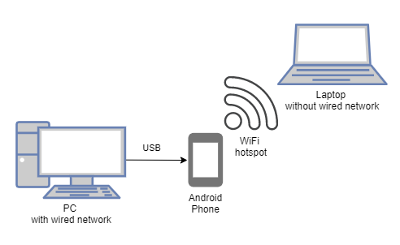

# Tetherspot

Script to simlify reverse USB tethering with WiFi hotspot on **non-rooted** Android

## Idea

- Use [Gnirehtet](https://github.com/Genymobile/gnirehtet) on PC to start reverse USB tethering
- Use [Every Proxy](https://play.google.com/store/apps/details?id=com.gorillasoftware.everyproxy&hl=en&gl=US) on Android to run proxy server
- Enable WiFi hotspot on Android
- Connect to created WiFi and specify proxy address

## `Tetherspot` could automate this process by

- Downloading and installing `adb` if needed
- Downloading and installing propper Gnirehtet version
- Downloading and installing EveryProxy apk
- Starting/stopping Gnirehtet, Every Proxy and WiFi hotspot in one command

## Usage

> Work in progress

---

## TODO

- [ ] Run `adb` commands from Python
- [ ] Enable wifi hotspot from `adb`
- [ ] Disable wifi hotspot from `adb``adb`
- [ ] Enable proxy server with from `adb`
- [ ] Disable proxy server with from `adb`
- [ ] Run Gnirehtet from Python
- [ ] Cleanup Gnirehtet on android side
- [ ] Working Windows prototype
- [ ] Determine OS version to get propper Gnirehtet
- [ ] Install EveryProxy if needed
- [ ] Install ADB if needed
- [ ] Write own Android proxy server (TCP, UDP, IPv6, netty, ktor)
